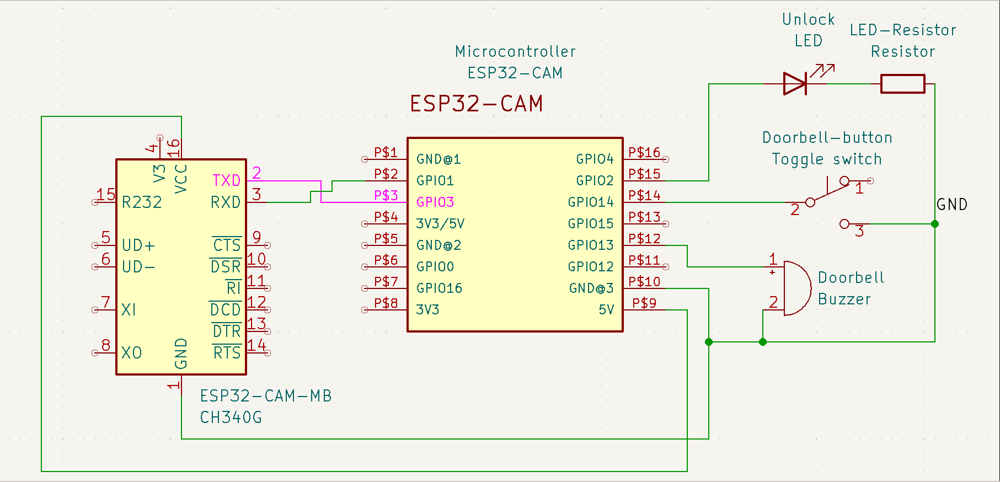

# Smart intercom

IoT project: Intercom using ESP32-CAM with live video output in a Flutter app.

# Navigation

- [How it works?](#how-does-the-project-works)
- [Components](#components)
  - [Hardware](#hardware)
  - [Software](#software)
- [Electrical schematic](#electrical-schematic)
- [Getting started](#getting-started)
  - [Requirements](#requirements)
  - [Quickstart](#quickstart)
  - [Configuration](#configuration)

# How does the project works?

The ESP32-CAM streams live video using the OV2640 camera module. The video is encoded in
MJPEG format and sent to the Flutter app via an HTTP server, where it is displayed in real time.
A toggle switch connected to the ESP32-CAM is used to simulate door-opening requests. When
the switch is activated, the system sends a notification to the Flutter app and triggers the buzzer as
an event signal.
The ESP32-CAM runs an HTTP server for notifications. The Flutter app periodically polls this
server. When the switch is pressed, the ESP32-CAM sends a JSON response, which the app uses
to display a notification.
The Flutter app includes a button to unlock the door. When this button is pressed, it sends an
HTTP request to the ESP32-CAM, which responds by turning on an LED and activating the door
unlock mechanism.
The system uses Wi-Fi for real-time communication between the ESP32-CAM and the Flutter app,
enabling live video streaming, event notifications, and unlocking commands.

# Components

## Hardware

- ESP32-CAM
- ESP32-CAM-MB in the role of FTDI module
- Toggle switch
- Buzzer
- LED + Resistor
- Power supply

## Software

- Arduino IDE - C++
- Flutter - Dart

# Electrical schematic



# Getting started

## Requirements

- [git](https://git-scm.com/book/en/v2/Getting-Started-Installing-Git)
- [flutter](https://docs.flutter.dev/get-started/install)
- [VS code](https://code.visualstudio.com/Download)
- [Arduino IDE](https://www.arduino.cc/en/software)
  - In Boards Manager install 'Arduino AVR Boards'.

## Quickstart

Clone this repo:

```
git clone https://github.com/roman-gulida/smart-intercom.git
```

In Visual Studio Code press ```Ctrl+Shift+P``` and press ```Flutter: new project```, then choose ```Empty Application```, select the folder in which you want to have the code, in  ```\lib\main.dart``` put the code from the ```main.dart``` file which you just cloned. In ```pubspec.yaml``` in ```dependencies:``` put:

```
http: ^1.1.0
image: ^4.0.15
```

So the ```pubspec.yaml``` ```dependencies``` should look like this:

```
dependencies:
  flutter:
    sdk: flutter
  http: ^1.1.0
  image: ^4.0.15  
```
Lastly run ```flutter pub get``` in your terminal.

With the Arduino part it would be easier, just open the cloned repo in the Arduino IDE.

## Configuration

In ```smart-intercom.ino``` change ssid and password for Wi-Fi connection: 

```
// Wi-Fi credentials
const char* ssid = "******";
const char* password = "******";
```

Then run the code on the ESP32-CAM and you would see output from the ```Serial Monitor``` with the microcontroller IP address:

```
ESP32 IP Address: 192.168.0.102
```

You need to copy this address and put in the ```main.dart``` file:

```
final String streamUrl = 'http://192.168.0.102:80';
final String notificationUrl = 'http://192.168.0.102:81/notification';
final String unlockUrl = 'http://192.168.0.102:82/unlock';
```

